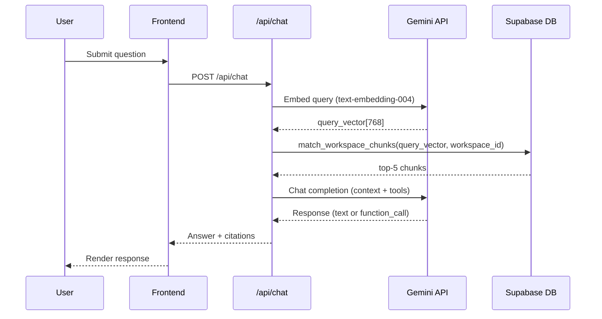

# TDS (Technical Design Specification) Skill

## Purpose
The Technical Design Specification (TDS) answers **HOW** the system is built — it is derived
from the TRD (which answers WHAT the system must do). The TDS is the authoritative reference
for every implementation decision: database schema, API contracts, component structure, data
flows, security patterns, and deployment configuration.

In an agent-driven workflow, the TDS is what the agent reads before writing any code. Every
implementation task in STAGES.md is executed by following the relevant TDS section.

---

## Relationship to Other Documents
```
Spec Document  →  TRD.md          (WHAT to build — requirements)
               →  TDS.md          (HOW to build it — design)
               →  STAGES.md       (WHEN to build — execution plan)
```
TDS MUST be consistent with TRD at all times. If a TRD requirement changes, the TDS must be
updated in the same session. Never let TRD and TDS drift.

---

## When to Activate
- User asks to **create a TDS** for the project.
- User asks to **update** any architectural decision, schema, API, or design pattern.
- Agent is about to implement a stage and needs to reference design decisions.
- A TRD requirement changes and the TDS must be kept in sync.
- A new integration, tool, or external service is added to the architecture.

---

## File Location Convention
```
<project-root>/docs/TDS.md
```
Always inside `docs/`. Never in the project root.

---

## TDS Document Structure
Every TDS MUST contain the following sections in exactly this order:

```
1.  Document Header              — name, version, status, owner, timestamps
2.  Update History               — reverse-chronological changelog (newest first)
3.  Architecture Overview        — system context diagram, guiding principles
4.  Technology Stack             — complete dependency list with versions and rationale
5.  Project Structure            — full directory tree with annotations
6.  Database Design              — full DDL (CREATE TABLE, indexes, functions, RLS)
7.  API Contract                 — every route: method, path, auth, request, response, errors
8.  Component Architecture       — Next.js component/page tree with data flow annotations
9.  RAG Pipeline Design          — sequence diagram + pseudocode for the full RAG loop
10. Tool Calling Loop Design     — sequence diagram + pseudocode for the tool execution loop
11. Security Architecture        — isolation enforcement, prompt injection defense, secret management
12. Environment & Configuration  — all env vars with descriptions, types, and required/optional
13. Deployment Architecture      — hosting setup, build process, environment promotion
14. Error Handling Patterns      — standard error shapes, retry logic, user-facing messages
15. Open Technical Decisions     — unresolved design choices (carry over from TRD Open Questions)
```

---

## Document Header Template
```markdown
# Technical Design Specification
## <Project Name>

| Field         | Value                          |
| :------------ | :----------------------------- |
| **Version**   | 1.0.0                          |
| **Status**    | Draft / In Review / Approved   |
| **Owner**     | <Author Name>                  |
| **Created**   | YYYY-MM-DD HH:MM IST           |
| **Updated**   | YYYY-MM-DD HH:MM IST           |
| **TRD Ref**   | TRD v1.0.0                     |
| **Project**   | <Repository or Project Name>   |
```

---

## Update History Format (CRITICAL RULE)
Same discipline as TRD and STAGES skills.

### Rules:
1. **Every modification** prepends a new row at the TOP of the Update History table.
2. Timestamp: current local system time → `YYYY-MM-DD HH:MM <timezone>`.
3. Summary: specific — name the sections and decisions that changed.
4. SemVer bumps:
   - **PATCH** (x.x.1): Typo fix, minor clarification, comment added.
   - **MINOR** (x.1.0): New API endpoint, schema column added, new component, env var added.
   - **MAJOR** (1.0.0 -> 2.0.0): Architecture change (e.g., switching vector DB, adding a new service boundary, changing auth provider).

### Template:
```markdown
## Update History

| Version | Date & Time          | Summary of Changes                                                    |
| :------ | :------------------- | :-------------------------------------------------------------------- |
| 1.2.0   | 2026-09-30 10:00 IST | Added streaming SSE design to RAG pipeline; updated API contract      |
| 1.1.0   | 2026-09-29 22:00 IST | Finalized DDL for document_chunks; updated HNSW index parameters      |
| 1.0.0   | 2026-09-29 19:00 IST | Initial TDS created from TRD v1.0.0                                   |
```

---

## DDL Writing Standards
When writing database DDL:
- Always use `uuid` as primary key type with `gen_random_uuid()` as default.
- Always include `created_at TIMESTAMPTZ NOT NULL DEFAULT now()`.
- Use `REFERENCES` with `ON DELETE CASCADE` for child records.
- Add a comment block before each table explaining its purpose and isolation rules.
- Include all indexes immediately after the `CREATE TABLE` statement.
- Always include `ENABLE ROW LEVEL SECURITY` even if policies are deferred.

```sql
-- Example DDL format
-- ================================================================
-- TABLE: workspaces
-- Purpose: Top-level isolation boundary. All child records
--          (documents, chunks, tasks, messages, logs) reference
--          a workspace_id that must match the active session.
-- ================================================================
CREATE TABLE workspaces (
  id          UUID PRIMARY KEY DEFAULT gen_random_uuid(),
  user_id     UUID NOT NULL REFERENCES auth.users(id) ON DELETE CASCADE,
  name        TEXT NOT NULL CHECK (char_length(name) BETWEEN 2 AND 100),
  created_at  TIMESTAMPTZ NOT NULL DEFAULT now()
);

CREATE INDEX idx_workspaces_user_id ON workspaces(user_id);
ALTER TABLE workspaces ENABLE ROW LEVEL SECURITY;
```

---

## API Contract Writing Standards
Each API route entry MUST include:

```markdown
#### `POST /api/documents/upload`
- **Auth**: Required (Supabase session cookie)
- **Content-Type**: `multipart/form-data`
- **Request Body**:
  | Field        | Type   | Required | Description                        |
  | :----------- | :----- | :------- | :--------------------------------- |
  | `file`       | File   | Yes      | PDF or TXT, max 10 MB              |
  | `workspaceId`| string | Yes      | UUID of the active workspace       |
- **Success Response** `201`:
  ```json
  { "documentId": "uuid", "status": "ingested", "chunkCount": 42 }
  ```
- **Error Responses**:
  | Code | Condition                          |
  | :--- | :--------------------------------- |
  | 400  | Missing file, wrong type, >10 MB   |
  | 409  | Duplicate document (same hash)     |
  | 401  | No valid session                   |
  | 500  | Ingestion pipeline error           |
```

---

## Sequence Diagram Standards
Use Mermaid `sequenceDiagram` for all flow diagrams:



---

## Component Architecture Standards
Document the Next.js component tree as an annotated directory listing:
- Mark Server Components with `[SC]` and Client Components with `[CC]`.
- Annotate each component's primary data source.
- Note which components are layout-level vs page-level vs feature-level.

---

## Agent Workflow: Creating a New TDS
1. Read `docs/TRD.md` fully to understand all requirements and constraints.
2. Read `docs/STAGES.md` to understand the delivery order.
3. Create `docs/TDS.md` with all 15 sections populated.
4. Set **Version: 1.0.0**, **Status: Draft**, **TRD Ref** to current TRD version.
5. Add initial Update History entry: `"Initial TDS created from TRD vX.X.X"`.
6. For DDL: write complete, executable SQL for all tables, indexes, and functions.
7. For API: document every planned route even if not yet implemented.
8. For diagrams: write Mermaid sequence diagrams for RAG loop and tool loop.

## Agent Workflow: Updating an Existing TDS
1. Read the current `docs/TDS.md` and identify the current version.
2. Make all required changes to the relevant sections.
3. Determine version bump (PATCH / MINOR / MAJOR).
4. **Prepend** a new Update History row with new version, timestamp, and specific summary.
5. Update the `**Updated**` and `**TRD Ref**` fields in the Document Header if TRD also changed.
6. Save and confirm to user with new version and timestamp.

---

## Quality Rules
- DDL in the TDS must be executable without modification — no pseudocode in DDL sections.
- Every API route referenced in the component architecture must have a full entry in the API Contract section.
- Every sequence diagram must show the exact field names (not generic placeholders) used in the actual code.
- The TDS version's **TRD Ref** must always reference the TRD version it was derived from.
- Update History is append-only — new rows prepended, existing rows never edited.
- If a design decision is changed, add a note in the Update History: `"Changed X from Y to Z — reason: ..."`.
